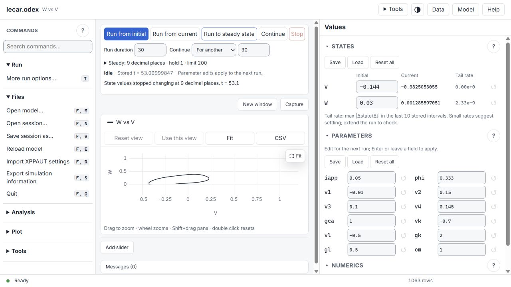
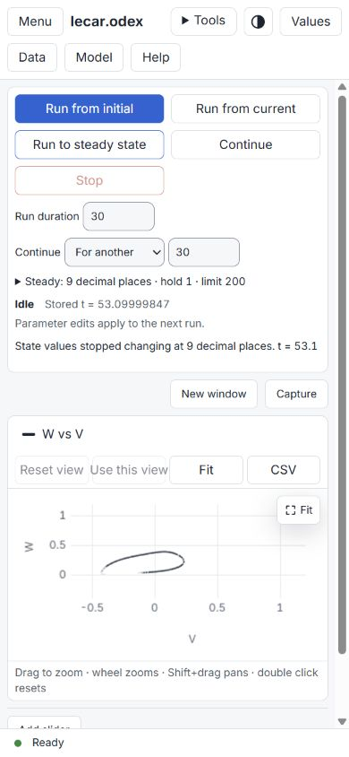
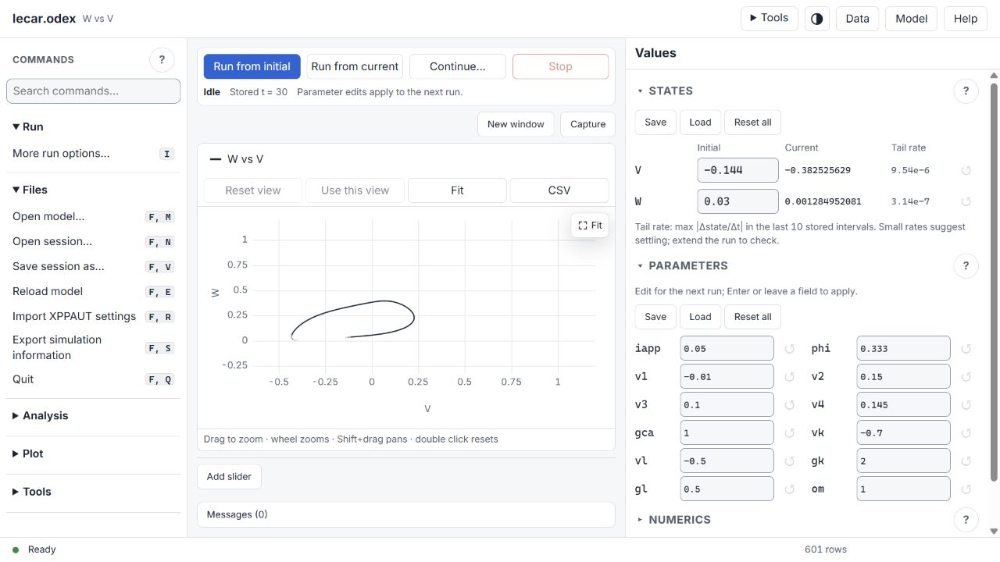
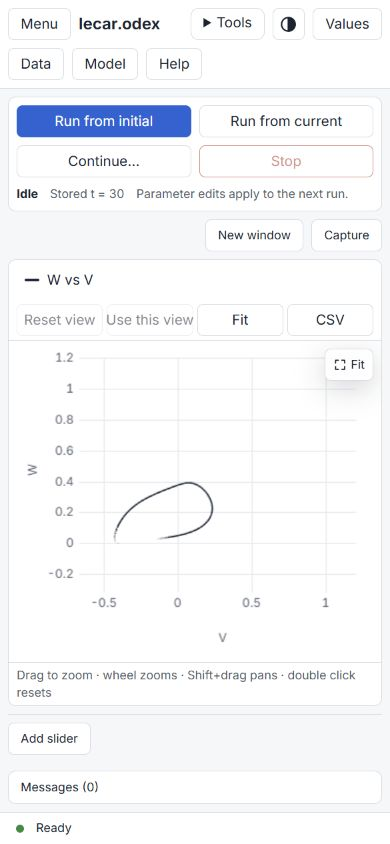
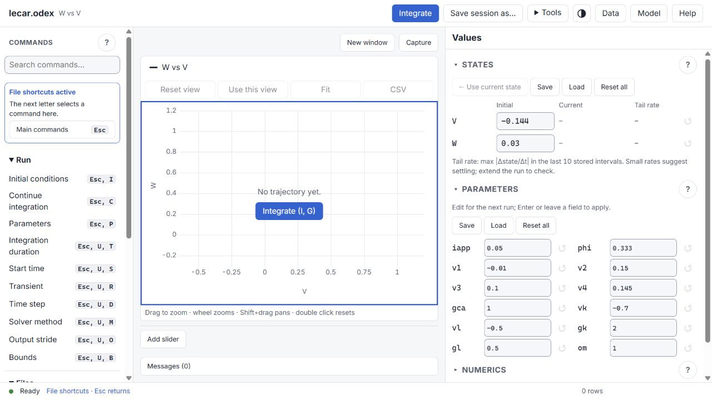
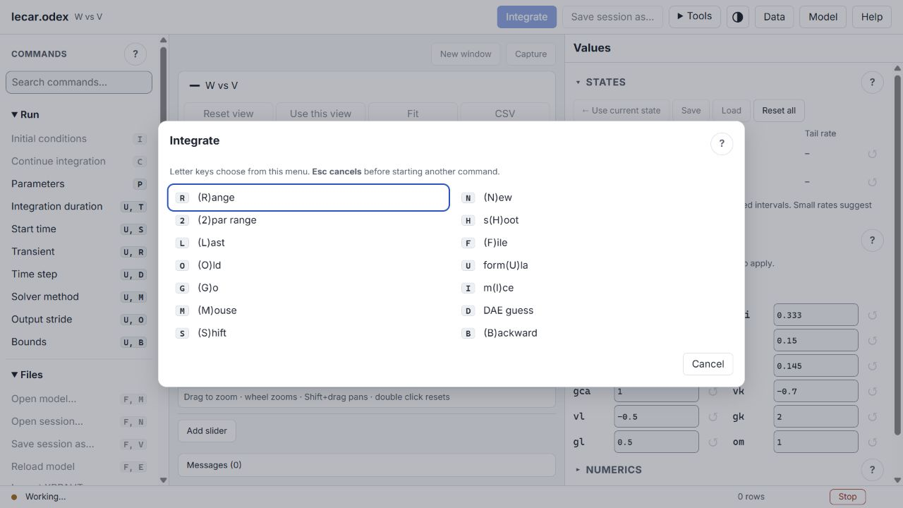

# Modern navigation implementation and validation

2026-10-04 · branch `codex/modern-navigation`, based on `0971ac0c`.

## Delivered

### W195 — Startup model selection and close regression

Reproduced the user's no-model Windows window stuck on Awaiting input with
Loading commands and no loaded model. The command owner `kindOf` returned
unknown for every command before hello, so an open startup ask prevented
its answer, cancellation and quit from being sent. Reused that owner to
permit startup controls and send Quit to the waiting core before its native
picker closes (avoiding a cancellation/load-error race). Loaded-session save/leave questions retain their owner.

Validation: UI typecheck/build and all 323 unit tests passed; native core
unit tests passed. Strict UCRT linking passed in a separate build executable
because Windows locks the user's running executable. `tools/startupcheck.mjs`
passed select-model-and-run, cancel-model-with-visible-load-failure and
close-before-model-load acceptance cases. Those picker responses are fixtures.
`tools/startupcheck.mjs --webview2` passed the real Windows close binding and
successful process exit before hello. The actual Windows Open model menu was
observed opening the OS picker, but choosing a file through that picker was
not independently automated. No claim of full OS picker acceptance coverage.

Test build: `build/xppautX-startup-fixed.exe`. The previously launched
`xppautX.exe` still contains the old code until it is replaced after exit.

### W193/W194 — Steady state and direct time controls

The run toolbar now includes one-click Run to steady state, inline Run
duration, and Continue For another / Until time. The steady summary exposes
decimal places, hold and maximum; its settings disclosure is optional.
The full-core comparison runs at every configured Dt, requiring every
state's rounded fixed-decimal representation to match the previous interval
throughout the hold. The next ordinary integration clears the result.
Direct continuation uses full core time and stores every Dt so output stride
cannot add a whole group of steps. Both actions retain the configured
numerical settings and recording support. Legacy C remains compatible.

Validation on the final native UCRT build:

- Strict `WERROR=1` build and all native unit tests passed, including 19
  monitor/validation checks. Final UI typecheck, build and 320 unit tests passed.
- `tools/steadycheck.py`: 61 checks passed. Analytic two-state decay,
  harmonic periodic motion, tiny double-precision drift hidden by float32
  samples, divergence, non-finite values, storage capacity, discrete maps,
  adaptive solver output intervals, malformed inputs, unchanged settings,
  direct extra/until time, one-Dt rounding, ordinary legacy output stride,
  silent recording replay and deterministically armed cancellation.
  The malformed signed-NaN precision token is rejected before integer conversion.
- Final desktop/layout/busy/steady browser run: 261 checks passed. A clean
  prior navigation/steady/layout/keys/record/player/busy/runs run passed 161
  checks. Together these cover run actions, time editing through actual
  mouse/keyboard input, keyboard context, recordings, busy guards, plot
  numbers/exports, zoom/pan/readout, values and responsive geometry.
- All six golden export checks passed without updating references.
- WSL Linux: strict `WERROR=1` build, all native unit tests and 61 protocol
  checks passed on code commit `6e64ecfce`; `build/steady-wsl.log` records the
  committed run. The WSL build/protocol logs are in the tool's Linux cache.
- Toolbar labels fit at widths 600–2000 in 25-pixel increments, at heights
  560 and 900. States and all parameters remain visible on the reference
  desktop; small screens retain the Values sheet and scrollable workspace.

Testing caught and fixed direct continuation's legacy output-stride
overshoot and a chart-height feedback loop. The chart now follows its host
without contributing its old pixel height to flex layout; the readout stays
in flow. Short stacked desktop layouts reserve more plot space. Visual
review caught button-label overlap and inconsistent field styling; both
were corrected. Tests that expected the removed empty-plot run button and
three sliders across the former wider plot were updated to the approved
layout. The phone tap test now fits data after parameter edits before
tapping a visible point. Artificial focus/blur input in the new duration
test was replaced with real mouse/keyboard input; the numerical assertion
was retained. Earlier failed logs are superseded by the clean final runs.

Logs: `build/steady-core-final.log`, `build/steady-assets-final.log`,
`build/steady-ui-unit.log`, `build/steady-ui-build.log`,
`build/steady-protocol-final.log`, `build/steady-golden.log`,
`build/steady-browser-acceptance.log` and `build/steady-browser-final-plot.log`.
The new protocol regressions are included in the normal verification gate
and Linux/Windows/sanitizer CI jobs; CI has not been run for this local branch.

Owner/reuse review covered the integrator, solver traits, numerical settings,
JSON state/command table, Field, Session.setNumeric and xppclient. The new
flows reuse do_init_data/cont_integ, existing error/bounds/cancellation/storage
handling, the shared field component and protocol client. The comparison
belongs to the integrator; defaults and supported precision come from hello.

The detector implements an unchanged-digits observation, not an analytical
equilibrium or stability certificate. Comparisons use Dt output intervals,
including for adaptive solvers. Slow motion or periodic sampling at an
unchanging phase can satisfy the rule. Precision is fixed decimal places
(0–15), not significant digits. Time controls resolve on the configured Dt
grid. Current core values are doubles; plot samples and live state values
remain float32. Storage capacity can terminate the run before the duration
limit. Steady settings are local to this UI instance and reset when the
model filename changes; they are not saved as session numerical settings.
Screenshots are browser evidence, not native operating-system dialog evidence.

The approved design in [modern-navigation.md](modern-navigation.md) is
implemented for W186–W191. The six published task cards are
[#239](https://github.com/MuhammadMoustafa/xppautX/issues/239),
[#240](https://github.com/MuhammadMoustafa/xppautX/issues/240),
[#241](https://github.com/MuhammadMoustafa/xppautX/issues/241),
[#242](https://github.com/MuhammadMoustafa/xppautX/issues/242),
[#243](https://github.com/MuhammadMoustafa/xppautX/issues/243) and
[#244](https://github.com/MuhammadMoustafa/xppautX/issues/244).
They remain open while the implementation is local and unmerged.

Commands are grouped into searchable Files, Run, Analysis, Plot and Tools.
The sidebar stays stable when legacy letter shortcuts change modes.
The core owns plain labels, identities, shortcut keys and action kinds;
the page only groups the identities. The header identifies the model;
the W192 follow-up puts common run actions in one toolbar above the plot
and session save in Files. Specialized workspace tools use a disclosure.

Native Windows/GTK/macOS File menu code exposes session open/save through
the existing prompt/picker route. Ctrl/Cmd+O and Ctrl/Cmd+S use the same
identified commands. Existing picker cancellation and overwrite logic is
reused. Browser mode retains browser uploads/downloads. Save explicitly
means Save session as; persistent save-in-place and recent files are outside
this design.

Ctrl/Cmd+K searches commands; arrows/Home/End navigate results. F6 and
Shift+F6 cycle visible work areas. Dialogs retain their focus handling.
Numerics names the selected solver and folds its unused fields with an
explanation. Working-value checkpoints copy authoritative parameter/IC
values, restore them in one validated command without running, and clear
on a model/session hello or reconnect. They are temporary; they do not
save solver settings or replace durable session files.

## Validation

| Gate | Result and scope |
|---|---|
| UI typecheck and build | Passed; final application bundles regenerated |
| UI unit tests | 314 passed, including exhaustive command reachability, search, action kinds, malformed identities and checkpoint copying/model boundaries |
| Strict Windows UCRT build | Passed with `WERROR=1` |
| Native unit gate | All passed; initial file-test failures were missing `cmd.exe` on PATH, resolved by adding Windows System32 to the runner PATH |
| Protocol suite | 717 checks passed, including existing scientific/session/recording regressions and 10 stable-navigation checks |
| Browser workflow sections | 402 checks passed across navigation, desktop, layout, keys, record, player, busy, files, native-binding fixtures and values; the 20-check player section was rerun after correcting its old label/keypress assertions |
| Visual inspection | Final desktop, 390×844 plot and command drawer reviewed; long labels wrap, eliminating the sidebar's horizontal scrolling |
| Windows WebView2 | 18 native-binding fixture checks passed in the actual desktop WebView2 host; picker results are still mocked |

The browser checks compare plotted numbers and data rows against the same
core's `output.dat`; checkpoint restore also compares every parameter and
IC exactly and verifies that no new series was generated. These establish
display/state consistency for the tested models, not independent
mathematical certification of all solvers.

Initial failures in new assertions were corrected to match the established
`message.error` event and legitimate search matches. Existing recording
assertions were updated for the plain labels and stable initiating command;
playback's actual command and answer-key sequence is still asserted.

Local logs are in `build/final-build.log`, `build/final-native-check.log`,
`build/ui-unit-final.log`, `build/final-server-check.log`,
`build/final-browser-check.log`, `build/player-final-check.log` and
`build/native-window-check.log`.
The broad browser log retains its three superseded player assertion failures;
the final player log passes all 20 checks. Build logs are not versioned.

## Review and limitations

Stable command IDs are validated against core metadata; unknown identities
and combinations with `key` or `win` are refused. Client and core kind
classification agree, preserving busy-state restrictions. Native actions
queue fixed normal commands and grant no new filesystem authority.
Recordings retain the stable command and its subsequent prompt answers;
legacy typed commands and recordings continue through their existing path.

Windows native code was compiled. Native-binding fixtures cover chosen
paths, cancellation, picker failure and avoiding duplicate downloads.
They are mocked bindings, not proof of an actual OS dialog interaction.
GTK and macOS menu additions have not been compiled or exercised on their
platforms. The prior review's live Windows picker evidence predates these
menu additions. Platform runtime acceptance remains a release check.

The existing palette, plotting engine and numerical engines are unchanged.
Some specialized popup menus still retain legacy terminology; this change
modernizes the main navigation and common workflow, not every scientific
dialog. No push or merge was performed.

## Visual evidence

### Permanent run toolbar (W192)

Common actions now have one permanent home above the plot: Run from initial
(I/G), Run from current (I/L), Continue (C), and Stop. The misleading former
Use current state tooltip said it copied without running; the core and the
existing runs regression prove Last copies the last state into Initial and
starts a new trajectory. The new label and manual describe that behavior.
Continue asks for an end time and appends to the existing trajectory.
Current/Continue require a prior state; computation actions are guarded
while busy. Activity and the active plot's last stored time are visible;
the time is sampled data, not a solver clock with double precision.

Removed duplicate run controls from the header, empty 2D/3D plots and States.
The default sidebar keeps More run options; parameter and solver editing
lives in Values, session save in Files, and search retains every original
command. Numerics prefix mode still exposes its applicable commands.

Searched/reused Session.menuAction, command kinds/useMayMain, existing Last
and Continue implementations in core/integrate.cpp, abort, inspectNumber,
and the active plot series. No run algorithm or protocol was added. Removed
the now-unused useCurrentState wrapper. No new filesystem or external
service access is involved in the toolbar.

Typecheck, 318 UI unit tests and the strict UCRT build pass. Combined final
section results total 170 browser checks for navigation, keys, runs, busy,
layout, recording, playback and 3D. Run-from-current checks exact starting
ICs; Continue checks appended rows and end time; busy tests guard all three
run buttons and stop through the toolbar. Recording/playback retain the
existing stable identities. The layout matrix includes widths 600–2000
at heights 560 and 900, plus the existing tall-window cases.

Early layout runs found that the toolbar squeezed short stacked desktops.
Compact buttons and a smaller Values height cap address this. The original
grid rule used invalid minmax(0, fit-content(...)) syntax, so the cap did not
apply; it is now a valid fit-content track. The final layout-only rerun
passes all 23 checks. Short stacked Values may scroll; side-by-side reference
States/Parameters still fit. Browser visual checks at 1280×720 and 390×844
confirm the controls and no narrow horizontal overflow. These screenshots
are browser evidence. Desktop native pickers are unchanged in this card.

Logs: `build/run-toolbar-unit.log`, `build/run-toolbar-build-final.log`,
`build/run-toolbar-browser.log` (keys/runs/record/player pass; superseded
layout failures), `build/run-toolbar-browser-final.log` (3D pass),
`build/run-toolbar-acceptance.log` (navigation/busy pass; superseded layout
failures), and `build/run-toolbar-layout-verified.log` (final layout pass).

### States and parameters follow-up

The user's follow-up prioritizes Run and scientific inspection. Run is now
the first navigation group. The former large grey checkpoint box is a
folded Recovery disclosure below the primary values. States appears before
Parameters, which uses two columns on wide desktops; Numerics starts folded.
The reference model's two states and twelve parameters fit without scrolling
at the tested 1280×860 desktop size and were visually confirmed at 1280×720.
Large models and narrow screens still require scrolling.

Values show ten significant digits, using compact scientific notation at
extremes. Focused edits retain the full core double. Final Current values
come from the core; live trajectory samples and tail diagnostics are
float32. Each state's Tail rate is the maximum sampled |Δstate/Δt| over up
to the last ten stored intervals. It is per-variable, in state/time units,
with no automatic threshold or steady-state claim. A sampled quiet tail can
miss motion or round small changes to zero; extend the run and inspect the
trajectory to assess settling. Invalid/missing samples show a dash.

The final follow-up passes typecheck, 317 UI unit tests, the strict UCRT
asset build, and 103 browser checks across navigation, layout, runs and
values. These cover all reference value fields on screen, inspection
precision, current-state updates, parameter edits, checkpoint recovery,
and sliders after widening the values column. Slider cards now fit the
actual plot width and the drag test scrolls the track into view before use.
The earlier run's hidden-upload-input geometry assertion was corrected to
check visible value fields. No numerical engine or native core code changed.
Logs: `build/values-inspection-unit.log`, `build/values-inspection-build.log`
and `build/values-inspection-browser-final.log`.

### Shortcut context follow-up

The user's unfinished I/G example identified the value of visible command
state. File and Numerics now have a sticky context box, active-command
highlighting, an explicit Main commands button, and status-bar feedback.
Shortcut hints reflect the active layer (R in File; Esc, I to return to Main
before I). Submenu dialogs explain that letters belong to their displayed
menu and Escape cancels. Keyboard routing is unchanged: an unfinished I
must be cancelled before typing F, R for the settings-file picker.

Validation passes typecheck, 318 UI unit tests, the final strict UCRT asset
build, and 62 browser checks: 35 navigation/keyboard checks plus 27 busy
checks. The first combined browser run had two busy-edit failures because
the test focused a hidden Numerics input. The helper now unfolds the section
and scrolls the field into view before editing; the unchanged busy-value
assertions pass on rerun. Logs: `build/shortcut-context-unit.log`,
`build/shortcut-context-browser-final.log` (includes the superseded failures),
`build/shortcut-context-busy.log`, and `build/shortcut-context-build-final.log`.
Browser screenshots at 1280×720 confirm the visible File context and
unfinished Integrate menu. These are browser evidence, not native OS dialog
evidence. No numerical core or native menu code changed in this follow-up.

### Initial implementation screenshots

## W195–W199: reported regressions and trace controls (2026-10-04)

Implemented startup model selection/closing, uppercase F/I handling, a Caps
Lock indicator, × and outside-click dialog dismissal, Tools dropdown outside
click/Escape dismissal, and direct variables/limits editing from plot axes.
Browser select controls keep their native dismissal behaviour. Data deletion
now operates on added columns only; plotted columns must first be removed
from the plot's axes. Time/model columns remain protected.

Freeze is per plot and defaults on to preserve the existing overlay behaviour.
Turning it off replaces earlier runs on the next new run. Continue extends
its current trajectory. Fit/Redraw retain older runs; 2D Fit bounds include
visible older traces and 3D Fit's box includes retained runs. Legends now
control individual current/retained traces, with hover names/highlights and
a shared double-click editor for legend text and a standard colour picker.
AUTO keeps its stability/symbol key and adds individual branch trace controls.
Legend areas are bounded so large diagrams cannot displace their plot.

Legend names, chosen hex colours and individual visibility are local view
presentation: they are not model variable renames and are not serialized or
included in core-generated exports. Freeze defaults on again after reopening
a session. Existing history storage limits remain unchanged. Native OS picker
selection is still represented by fixtures in automated coverage; real native
startup-close coverage uses the installed WebView2 close bridge.

Owners searched and reused: `protocol/kinds.ts` and `session.typeKey`,
`AskDialog`/`dialogFocus`, `FileDialog`, `AutoAxes`, `MenuPanel`/`TitleBar`,
`browse_data`/`storage`, `plot_data` history, `graf_par.fit_window`,
`model`/`nearest`/`render3d`, `Chart`/`DiagramChart`, and the shared CDP driver.
Deletion uses the existing column lookup and recomputation; no numerical
integration code changes. Legend names are rendered as text, not HTML; colour
input uses the browser's hex colour picker. No new external file path handling
is introduced by the trace controls.

Validation:

- `npm run typecheck`, `npm run build`, `npm test`: 327 UI tests passed.
- Strict native UCRT build (`WERROR=1`) and native unit suite passed:
  `build/ui-controls-final-build.log`; final standalone link:
  `build/ui-final-link.log` plus `build/ui-link-command.sh`.
- 81 browser checks passed for keys, runs, AUTO views and 3D:
  `build/ui-browser-regression.log`.
- 150 final browser checks passed for AUTO, 3D, viewport, navigation and
  steady-state UI: `build/ui-final-browser.log`.
- The earlier broader run completed 205 desktop checks before its AUTO
  section failed: the new large legend list displaced the plotting area.
  Bounded legend layout fixes that regression; the final AUTO section passes.
  Superseded evidence: `build/ui-broad-browser.log`.
- `node tools/uiworkflowcheck.mjs build/xppautX-ui-fixed.exe`: real-model
  uppercase F/I, Caps Lock status, outside dismissal, Tools dropdown,
  main/additional axis editor, Freeze, Continue, retained-run Fit, individual
  visibility, hover, legend text/colour, deleting a middle derived column
  and recomputation, retained 3D rendering/Fit/visibility all passed.
- `node tools/startupcheck.mjs build/xppautX-ui-fixed.exe`: browser startup
  select/cancel/close passed. The `--webview2` case passed real native
  startup close and process exit 0 after the close-order fix.

The delivered standalone copy is
`C:\gitRepos\xppautX\build\xppautX-ui-W199.exe` (SHA-256
`BD35CE1FA3552539853C6231E129653529A4087BA0F75F211FE381C0EE256535`).
The worktree's same binary is `build/xppautX-ui-fixed.exe`.

The final review also covers closing a file prompt during replacement:
its pending upload resolves as cancelled, writes nothing and sends no late
answer. That regression is part of the 327 UI tests (`upload.test.ts`).

Strict WSL builds and the native unit suite passed for the committed core
(`build/ui-wsl-build-test.log`, `build/ui-wsl-final.log`). The first protocol
run had one outdated assertion that required Redraw to clear history; the
updated test checks that a retained run's values survive Redraw and that
Redraw after Erase does not issue another history clear. Final protocol and
steady checks: `build/ui-wsl-protocol-final.log`.

Final Linux outcome: native unit suite passed, 718 protocol checks passed,
and 61 steady-state/direct-continuation checks passed with no failures.
No processes started for this batch remain running, and the main checkout's
background-task ledger has no lines owned by this batch. The unrelated
pre-existing W21-agent ledger entry was preserved.

## W200: all-state live values and sandbox fixtures (2026-10-06)

Cause: ValuesPanel used the active plot's float32 columns while busy. States
absent from that plot stayed at the preceding run's values. The integration
owner now calls the UI seam after every accepted output step, before transient
and Poincare storage filtering. The JSON state owner publishes all solver
ODE/Markov doubles together at the existing 50 ms input cadence, with final
values still supplied by the normal state event. ValuesPanel consumes those
values independently of plot windows. Initial conditions and resume state
remain unchanged. Noutput determines output steps; adaptive internal substeps
are not display steps. This reuses XppUi, ProtocolSession, xpp::every and the
existing state reducer; no second solver/state-storage owner was introduced.

Windows validation: strict UCRT build and core unit suite passed, UI typecheck
and 328 unit checks passed, browser values/live checks passed, and 61 steady/
continuation checks passed. tools/livestatecheck.py uses XPP_NO_THROTTLE and
checks all three doubles at all eight analytically known output steps, including
transient steps without any trajectory subscription. The UI regression checks
full-precision values and preservation of ICs and plot objects.

The actual core writers produced sandbox/PY_S1Bf-live.recx and .snapx in the
main checkout. tools/makesandboxfixture.py verifies eight live states, the
three-step recording fingerprint, silent and interactive replay, and snapshot
restoration of states, parameters, time and 40,001 trajectory rows. The run is
200 ms from initial conditions plus 200 ms continuation, with original Iapp=0.
The preceding W199 executable and the new one gave identical final states,
parameters, ICs, time and row count. Model equations/settings were not edited.
The generator uses the existing Server/read_recx/replay_recording clients and
core serialization, never a hand-assembled snapshot. File names are fixed,
files are written through the core's atomic writers in scratch folders, and
only successfully validated fixtures are copied to the requested output folder.

Delivered executable: C:\gitRepos\xppautX\build\xppautX-live-states.exe,
SHA256 D736D2B20F60EF0F3134BF5E55ECD4E06CCFDBBA2EA551AAFEC6C3F1CC40E4B1.
Sandbox fixtures are local, ignored user files; the reproducible generator is
versioned. Native file-picker behavior was not changed or re-tested in W200.
