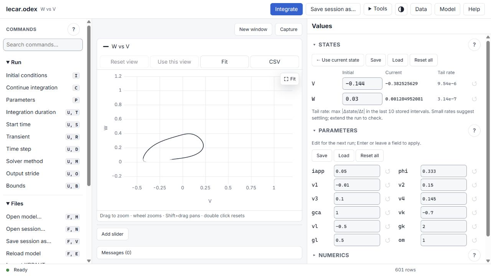
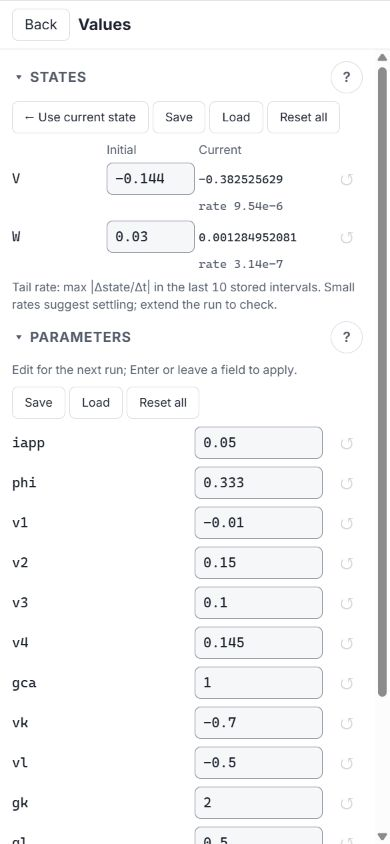
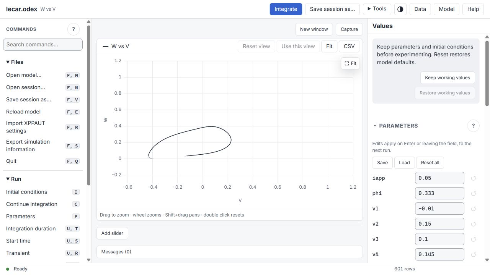
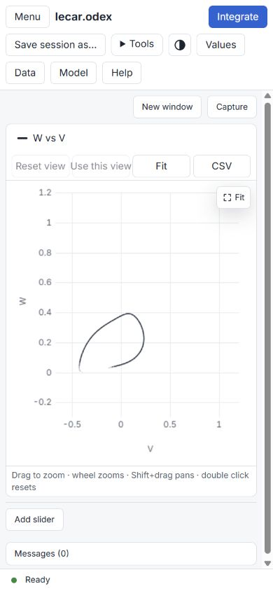
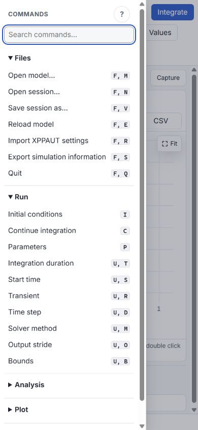

# Modern navigation implementation and validation

2026-10-04 · branch `codex/modern-navigation`, based on `0971ac0c`.

## Delivered

The approved design in [modern-navigation.md](modern-navigation.md) is
implemented for W186–W191. The six published task cards are
[#239](https://github.com/MuhammadMoustafa/xppautX/issues/239),
[#240](https://github.com/MuhammadMoustafa/xppautX/issues/240),
[#241](https://github.com/MuhammadMoustafa/xppautX/issues/241),
[#242](https://github.com/MuhammadMoustafa/xppautX/issues/242),
[#243](https://github.com/MuhammadMoustafa/xppautX/issues/243) and
[#244](https://github.com/MuhammadMoustafa/xppautX/issues/244).
They remain open while the implementation is local and unmerged.

Commands are grouped into searchable Files, Run, Analysis, Plot and Tools.
The sidebar stays stable when legacy letter shortcuts change modes.
The core owns plain labels, identities, shortcut keys and action kinds;
the page only groups the identities. The header emphasizes the model,
Integrate and Save session as. Specialized workspace tools use a disclosure.

Native Windows/GTK/macOS File menu code exposes session open/save through
the existing prompt/picker route. Ctrl/Cmd+O and Ctrl/Cmd+S use the same
identified commands. Existing picker cancellation and overwrite logic is
reused. Browser mode retains browser uploads/downloads. Save explicitly
means Save session as; persistent save-in-place and recent files are outside
this design.

Ctrl/Cmd+K searches commands; arrows/Home/End navigate results. F6 and
Shift+F6 cycle visible work areas. Dialogs retain their focus handling.
Numerics names the selected solver and folds its unused fields with an
explanation. Working-value checkpoints copy authoritative parameter/IC
values, restore them in one validated command without running, and clear
on a model/session hello or reconnect. They are temporary; they do not
save solver settings or replace durable session files.

## Validation

| Gate | Result and scope |
|---|---|
| UI typecheck and build | Passed; final application bundles regenerated |
| UI unit tests | 314 passed, including exhaustive command reachability, search, action kinds, malformed identities and checkpoint copying/model boundaries |
| Strict Windows UCRT build | Passed with `WERROR=1` |
| Native unit gate | All passed; initial file-test failures were missing `cmd.exe` on PATH, resolved by adding Windows System32 to the runner PATH |
| Protocol suite | 717 checks passed, including existing scientific/session/recording regressions and 10 stable-navigation checks |
| Browser workflow sections | 402 checks passed across navigation, desktop, layout, keys, record, player, busy, files, native-binding fixtures and values; the 20-check player section was rerun after correcting its old label/keypress assertions |
| Visual inspection | Final desktop, 390×844 plot and command drawer reviewed; long labels wrap, eliminating the sidebar's horizontal scrolling |
| Windows WebView2 | 18 native-binding fixture checks passed in the actual desktop WebView2 host; picker results are still mocked |

The browser checks compare plotted numbers and data rows against the same
core's `output.dat`; checkpoint restore also compares every parameter and
IC exactly and verifies that no new series was generated. These establish
display/state consistency for the tested models, not independent
mathematical certification of all solvers.

Initial failures in new assertions were corrected to match the established
`message.error` event and legitimate search matches. Existing recording
assertions were updated for the plain labels and stable initiating command;
playback's actual command and answer-key sequence is still asserted.

Local logs are in `build/final-build.log`, `build/final-native-check.log`,
`build/ui-unit-final.log`, `build/final-server-check.log`,
`build/final-browser-check.log`, `build/player-final-check.log` and
`build/native-window-check.log`.
The broad browser log retains its three superseded player assertion failures;
the final player log passes all 20 checks. Build logs are not versioned.

## Review and limitations

Stable command IDs are validated against core metadata; unknown identities
and combinations with `key` or `win` are refused. Client and core kind
classification agree, preserving busy-state restrictions. Native actions
queue fixed normal commands and grant no new filesystem authority.
Recordings retain the stable command and its subsequent prompt answers;
legacy typed commands and recordings continue through their existing path.

Windows native code was compiled. Native-binding fixtures cover chosen
paths, cancellation, picker failure and avoiding duplicate downloads.
They are mocked bindings, not proof of an actual OS dialog interaction.
GTK and macOS menu additions have not been compiled or exercised on their
platforms. The prior review's live Windows picker evidence predates these
menu additions. Platform runtime acceptance remains a release check.

The existing palette, plotting engine and numerical engines are unchanged.
Some specialized popup menus still retain legacy terminology; this change
modernizes the main navigation and common workflow, not every scientific
dialog. No push or merge was performed.

## Visual evidence

### States and parameters follow-up

The user's follow-up prioritizes Run and scientific inspection. Run is now
the first navigation group. The former large grey checkpoint box is a
folded Recovery disclosure below the primary values. States appears before
Parameters, which uses two columns on wide desktops; Numerics starts folded.
The reference model's two states and twelve parameters fit without scrolling
at the tested 1280×860 desktop size and were visually confirmed at 1280×720.
Large models and narrow screens still require scrolling.

Values show ten significant digits, using compact scientific notation at
extremes. Focused edits retain the full core double. Final Current values
come from the core; live trajectory samples and tail diagnostics are
float32. Each state's Tail rate is the maximum sampled |Δstate/Δt| over up
to the last ten stored intervals. It is per-variable, in state/time units,
with no automatic threshold or steady-state claim. A sampled quiet tail can
miss motion or round small changes to zero; extend the run and inspect the
trajectory to assess settling. Invalid/missing samples show a dash.

The final follow-up passes typecheck, 317 UI unit tests, the strict UCRT
asset build, and 103 browser checks across navigation, layout, runs and
values. These cover all reference value fields on screen, inspection
precision, current-state updates, parameter edits, checkpoint recovery,
and sliders after widening the values column. Slider cards now fit the
actual plot width and the drag test scrolls the track into view before use.
The earlier run's hidden-upload-input geometry assertion was corrected to
check visible value fields. No numerical engine or native core code changed.
Logs: `build/values-inspection-unit.log`, `build/values-inspection-build.log`
and `build/values-inspection-browser-final.log`.

### Initial implementation

