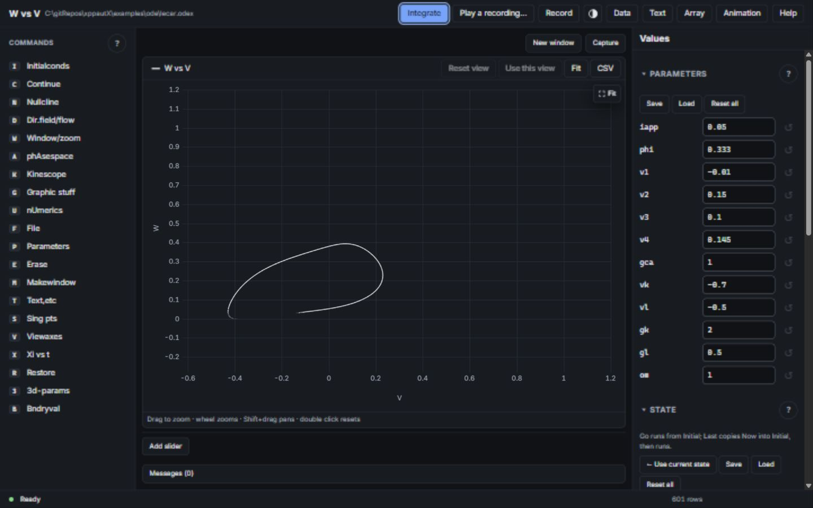
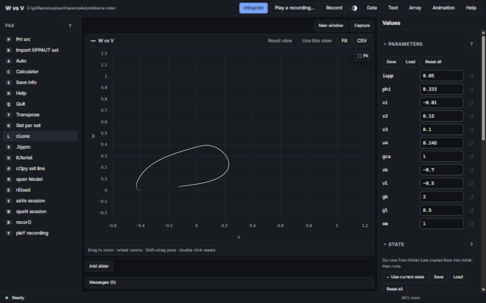
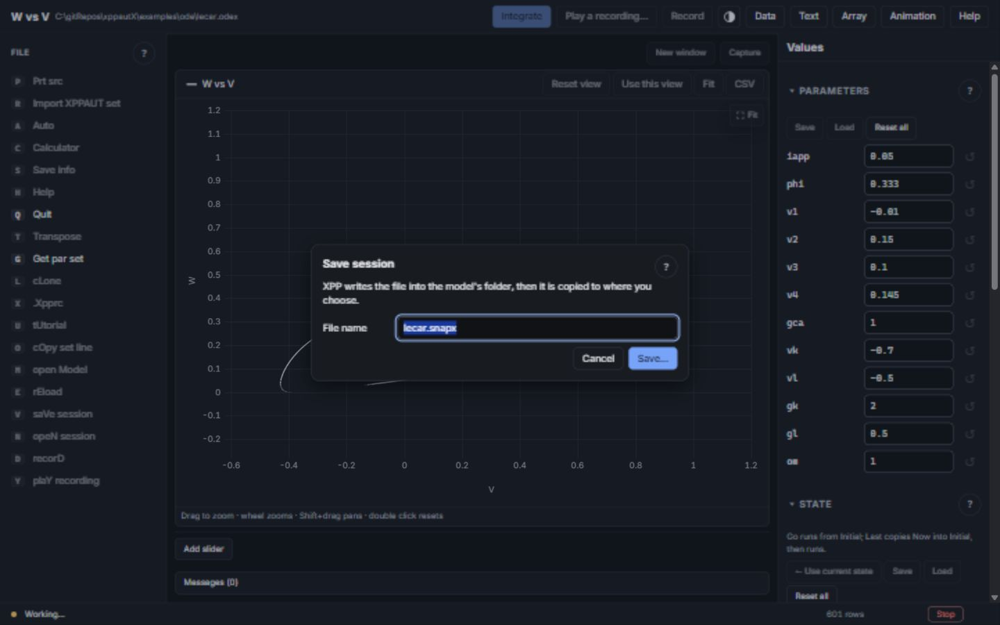

# UI/UX review — 2026-10-04

## Assessment

The tested workflows work, and the visual foundation is good: restrained dark colours, consistent fields, a prominent Integrate action, readable plots, responsive panels, inline validation and contextual help. The interface nevertheless feels like two generations of application combined. Native desktop navigation and the embedded command sidebar overlap; legacy abbreviations and unusual capitalization obscure the purpose of commands; routine workflows compete with specialized tools for attention.

**Native file dialogs have been implemented. The File menu experience is only partly modernized.** Improving navigation and terminology would produce more benefit than replacing the visual theme.

This is a review, not an implementation change. Application code and committed bundles were left unchanged. Recommendations below are separated from verified defects and test limitations.

## Scope and evidence

- Checkout: `0971ac0c`, inspected on Windows, local executable dated 2026-10-03. The executable was not rebuilt for this review; results describe that binary and source inspection describes this checkout. Exact binary/source equivalence was not independently established.
- Live inspection: Windows desktop startup and native File/Open dialog/menu; browser preview of `lecar.odex`, integration, command menus and the session-save prompt. Browser layout inspected at the default narrow panel width and 1440 × 900.
- Existing automated tests: 310 UI unit tests; 342 basic browser workflow checks; 297 advanced scientific workflow checks; 18 native-dialog routing fixture checks. All **967** reported checks passed in the completed runs. Browser checks include bookkeeping checks such as absence of lost commands; this is not 967 independent end-user scenarios.
- Numerical evidence: plotted T/V/W compared with `output.dat`; data table row 500 checked by scrolling and keyboard navigation; CSV header, row count and row 500 checked. These demonstrate consistency of displayed/exported data for the tested model, not independent mathematical certification of every solver or model.
- Existing tests were reused: `web2/test`, `tools/web2check.mjs`, `tools/cdp.mjs`. Reviewed existing owners: `core/menus.cpp`, `core/xpp_window.cpp`, `web2/src/pickers.ts`, `web2/src/session.ts`, and the UI components/styles. No duplicate test harness or application logic was introduced.
- Logs: `build/ui-ux-unit-2026-10-04.log`, `build/ui-ux-browser-2026-10-04.log`, `build/ui-ux-science-2026-10-04.log`, `build/ui-ux-native-routing-2026-10-04.log`. Build logs are local evidence, not necessarily versioned.

## Save/load: what is fixed, what remains

Windows uses COM Common Item Dialogs (`IFileOpenDialog` / `IFileSaveDialog`), not a custom imitation. They require existing read files and paths, confirm overwrites for saves, and return the chosen filesystem path. `core/xpp_window.cpp:325` owns this implementation; line 952 binds `__xppFileDialog` into the page. `web2/src/session.ts:1362` answers file prompts through that binding, and `AskDialog` suppresses the custom file prompt when it is available.

The live Windows File/Open dialog was visibly native and filtered models, sessions and recordings. Native-routing fixtures verified session save, set import, parameter/initial-condition saves, table/plot CSV saves, cancellation and failure notifications. They also verified that no custom web file dialog appeared and that native saves did not trigger duplicate downloads. **These fixtures substitute the picker; they do not exercise the real Windows Save dialog.**

Browser mode deliberately has a different path: a web prompt asks for a name, followed by the browser picker or download. The core also writes in the model folder. Imports may copy files into that folder and ask about collisions. The live browser save prompt reproduced this extra step. An older executable, browser mode, or desktop browser fallback can therefore still show the strange-looking workflow even though native desktop support exists.

macOS and Linux have native picker implementations in source. Their actual dialogs were not exercised here.

## Findings and recommended changes

### UX-01 — High: two File menus split the basic document workflow

**Verified in desktop UI and source.** Windows File offers only Open model, Reload and Quit (`core/xpp_window.cpp:407`). Saving and opening sessions are in the command sidebar's File menu (`core/menus.cpp:53`). A user who looks in the native menu to save their work cannot find it.

Reproduce: launch desktop mode, open the native File menu; compare it with Commands → File. The latter also contains AUTO, Calculator, Transpose and other unrelated actions. The confusion is about menu organization even when the actual chooser is native.

Recommendation: expose Open model/session, Save session, Save session as, Reload, recent files and Quit in one coherent desktop File menu. Use the existing session commands and picker owner. Keep the legacy key sequences available. Put AUTO under Analysis, Calculator under Tools, and Transpose with Data. Browser mode should expose the same task grouping inside its UI.

Acceptance: a new user can open a model, save a session, reopen it and export data without discovering a second File menu. Existing shortcuts and overwrite/cancel behavior continue to work.

### UX-02 — High: legacy names make capabilities difficult to discover

**Verified in live UI and menu definitions.** Examples include `Sing pts`, `Graphic stuff`, `Prt src`, `Bndryval`, `Xi vs t`, `phAsespace`, `saVe session` and `opeN session`. The separate key badge already communicates the shortcut; mixed capitalization makes reading harder. `Restore` means redraw, which is easy to confuse with loading previous state. `Save info` and `Save session` are materially different operations.

Recommendation: plain labels such as Equilibria and stability, Plot appearance and export, Model source, Boundary-value solver, Variable vs time, Phase space, Save session and Redraw. Retain legacy wording in help and shortcut documentation. Explain session (.snapx), recording (.recx), model (.ode/.odex), parameter and initial-condition files near their actions.

Acceptance: task descriptions match visible labels; users can distinguish saving their workspace from exporting a report, model or data.

### UX-03 — Medium: keyboard reachability is correct but inefficient

**Verified by existing browser tests.** Their tested traversal took 41 Tab presses to reach Values, 81 to reach the plot, 89 to reach Data and 91 to reach Text in the relevant scenarios. These are test-specific paths, not a minimum for every user. The skip-to-plot link and legacy letters help, but discoverability still relies on learning those mechanisms. `hotkeys.ts:21` excludes Ctrl/Cmd/Alt combinations and provides no conventional Ctrl/Cmd+O/S action.

Recommendation: add an advertised pane-cycle shortcut, skip links for Values/Data, and conventional open/save shortcuts in appropriate surfaces. Prefer arrow navigation within a command list over making every command an obligatory Tab stop; preserve the existing letter sequences. Add a searchable command palette using the existing command metadata.

Acceptance: keyboard users can reach the plot, parameter editor and data table in a few intentional steps, with visible focus and correct return focus after dialogs.

### UX-04 — Medium: specialized toolbar actions crowd routine work

**Verified visually.** The title row gives Play a recording, Record, Data, Text, Array, Animation and Help persistent buttons. Narrow widths wrap these into multiple rows. On desktop the heading is the plot title (for example W vs V) and the model path is small. This gives recording tools considerable prominence while Save session is buried.

Recommendation: make model identity and session save easy to see; retain Integrate and Stop as primary actions. Group related view buttons, and place recording/animation tools in an overflow or dedicated section. Rename Text to Model or Equations/source. Provide a meaningful model-name fallback when the plotted quantities change.

Acceptance: the common open → edit → run → inspect → save workflow remains obvious at desktop, tablet and phone widths. No action disappears without an accessible alternate route.

### UX-05 — Medium: solver settings that do nothing still look editable

**Verified in browser accessibility state and source (`ValuesPanel.tsx:266`).** With Runge-Kutta selected, Tolerance, Minimum step, Maximum step and other unused settings remain editable. The interface marks them visually and explains the reason in a tooltip, which is useful, but an unfamiliar user can still think changing tolerance changes this solver's accuracy.

Recommendation: show a persistent explanation beside the solver choice, fold irrelevant settings into an advanced section, and label them “Not used by Runge-Kutta.” If retaining edits for the next method is intentional, say so explicitly rather than relying on hover.

Acceptance: users can identify the active accuracy/step controls for the selected method without consulting tooltips, and understand fixed-step versus adaptive methods.

### UX-06 — Medium: parameter editing has weak recovery for exploratory work

**Source-confirmed design limitation, not a failed test.** Fields commit on Enter/blur; Reset restores model defaults. There is deliberately no undo in Values (`ValuesPanel.tsx` introductory documentation). Returning to a previous experimental value is different from resetting to the original model. Numerics does explain that edits apply to the next run.

Recommendation: add undo for parameter/initial-condition changes or a lightweight named working-value snapshot. Make commit timing and “applies to next run” clear in Parameters and State as well as Numerics. Associate saved/comparison runs with the parameter values used.

Acceptance: after several experiments, users can restore the immediately previous value set without retyping values or restoring the entire session. No run is silently relabelled with values edited after it started.

### UX-07 — Low: export wording contradicts native behavior

**Verified in source and routing tests.** Plot CSV and Data CSV tooltips say “written by the core, then downloaded”; native routing writes directly to the selected path. Similar wording appears for captured-frame GIF export.

Recommendation: user-facing labels should say Export plotted data / Export all data / Export animation. Explain scope and format; display the destination on success. Mention download only when that is the actual browser delivery method.

Acceptance: desktop users are not told to look in Downloads for a file they saved elsewhere. Plot export and all-row export are clearly distinguished.

### UX-08 — Low: polish the visual hierarchy and repeated controls

**Visual judgment.** Dark mode is appealing and appropriately restrained for scientific work. Consistent spacing, borders and typography are good. However, the 20-item sidebar is a dense flat list, long parameter lists dominate the Values pane, and Fit appears both in the plot toolbar and at the plot corner. The desktop's white native menu strip can contrast sharply with the dark workspace.

Recommendation: group commands by workflow (Run, Analyze, Plot, Files, Tools), add parameter search for large models, consolidate redundant view controls where practical, and improve model/title hierarchy. Keep generous plot space and the current theme palette. Native chrome/theme alignment is a secondary platform task; do not replace functional native dialogs for cosmetic consistency.

Acceptance: beginner and advanced actions have discernible hierarchy, large models remain navigable, and 100–200% scaling preserves readable controls and plot space.

## Use-case coverage

| Use case | Current evidence | Remaining UX work / limit |
|---|---|---|
| Open model, reload and switch models | Live native Open; browser workflow checks | Unified File navigation; actual native session reopening not manually completed |
| Edit parameters, ICs and numerics | Unit/browser validation, precision, reset, load/save and slider checks passed | Previous-value recovery; clear active solver controls |
| Integrate and inspect trajectory | Live 601-point plot; output.dat comparison, hover, zoom, pan, reset checks passed | Clearer model identity; smoother keyboard pane access |
| Nullclines and direction fields | Advanced browser checks passed, including visibility and erase | Discoverability through Analysis grouping |
| Equilibria and stability | Values/eigenvalue display and Import checks passed | Replace Sing pts label |
| AUTO continuation | Advanced browser checks passed, including diagram and focus behavior | Accessible Analysis entry; specialist learning still required |
| 3D, array plots and animation | Advanced browser checks passed | Better grouping; native device interaction not manually checked |
| Compare runs and parameter sweeps | Advanced runs/sliders checks passed | Make run provenance and restoration easy to understand |
| Data inspection and CSV export | Rows compared with output.dat; export checks passed | Clarify plotted versus all stored data and file destination |
| Save/load sessions and record/replay | Browser and native-routing fixtures passed; quit/cancel checked | Unified Save/Save as; real native Save/overwrite interaction remains open |
| Error recovery and malformed input | Load-error file/line/cause checks and field validation passed | No fresh comprehensive malformed scientific-model campaign |
| Keyboard and small-screen use | Keyboard/focus tests and 390×844 overflow/44px-target checks passed | Screen-reader task testing and shorter focus paths |

## Verification limits

Initial sandboxed runs failed to launch/attach the browser or access the generated test directory; completed browser/unit reruns outside the sandbox passed. Those initial failures are not treated as application defects.

The automated WebView2 run failed to expose the application page on both attempts, including an outside-sandbox rerun. This is a native-harness limitation in this review: a separately launched desktop window and native Open dialog were observed live. Native-dialog routing was consequently tested through the fixture suite in browser mode. Actual Windows Save/overwrite, end-to-end native file round trips, and desktop screen-reader behavior are **not** certified by the fixture result. Desktop accessibility targeting also prevented completing the manual model-open round trip; source and browser evidence cover the loaded-model visual review.

No macOS/Linux UI interaction, high-DPI/multi-monitor matrix, full accessibility audit, independent solver-convergence study, or representative new-user usability session was performed. Numerical consistency checks cannot prove that a model is scientifically appropriate or that solver settings yield converged results. Browser tests establish the shared web UI behavior, not every native shell behavior.

## Suggested implementation order

1. Unify File navigation and add conventional open/save shortcuts using existing commands.
2. Replace legacy labels and group commands without breaking letter shortcuts.
3. Shorten keyboard pane navigation and clarify active solver controls.
4. Improve parameter recovery and toolbar/model identity.
5. Refine export wording and visual polish; validate real native dialogs and screen readers on each supported platform.

## Screenshots

Screenshots below are the shared UI in **browser mode**, not proof of native dialog behavior.

